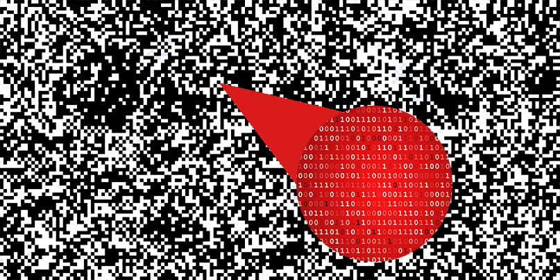

<ins>**Legal / Ethical Notice:**</ins>  
This site is for educational purposes only. Do **not** use the materials here for illegal activity. All code samples are non-actionable and designed for learning in isolated environments.

***

<ins>**What is Malware Obfuscation? ([T1027](https://attack.mitre.org/techniques/T1027/))**</ins>
For adversaries to introduce their malware into a target system, they must attempt to bypass detection systems that are becoming more commonplace and sophisticated. Obfuscation is the act of making their payload appear differently in order bypass these systems, whether in the files entirerty or sections that would be more easily discovered.  

***

<ins>**Three Common Methods of Obfuscation**</ins>

**Software Packing ([T1027.002](https://attack.mitre.org/techniques/T1027/002/))**

**Command/Script Obfuscation ([T1027.010](https://attack.mitre.org/techniques/T1027/010/))**

**Encrypted/encoded Files or Strings ([T1027.013](https://attack.mitre.org/techniques/T1027/013/))**

***

<ins>**Steganography ([T1027.003](https://attack.mitre.org/techniques/T1027/003/))**</ins>

Steganography is the concealment of information within a different representation, a historic example is the shaving of a greek servant's head to tattoo a message on their scalp and hide it under their regrown hair. In the digital context, this can be seen with malicious contents being hidden in files such as pictures, documents, or program macros (as seen in the methods above), that to the human eye or surface-level analysis appear benign.

<figure>
  
  <figcaption>Steganography hides data in plain sight (Dickson, 2020)</figcaption>
</figure>
  
The linked demonstration is a **client-side** script that will take a PNG format image and hide, or extract, a text string utilising the least significant bits (LSB) method, specifically the blue channel (of the RGB data). If you wish to validate that it actually alters the image, feel free to hash the output image files.

[Steganography demo](https://gutbug.github.io/SecPrin-obfuscation-research-project/demo/stego.html)

***

**Key Takeaways and Further Reading**
