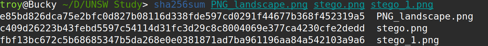

<ins>**<h4>Legal / Ethical Notice:</h4>**</ins>  

This site is for educational purposes only. Do **not** use the materials here for illegal activity. All code samples are non-actionable and designed for learning in isolated environments.

***

<ins>**What is Malware Obfuscation? ([T1027](https://attack.mitre.org/techniques/T1027/))**</ins>

For adversaries to introduce their malware into a target system, they must attempt to bypass detection systems that are becoming more commonplace and sophisticated. Obfuscation is the act of making their payload appear differently in order bypass these systems, whether in the files entirety or sections that would be more easily discovered. There is a number of ways that adversaries can carry this out, and more are being developed constantly, a database is maintained by [MITRE ATT&CK](https://attack.mitre.org/techniques/T1027/) and these obfuscation methods are just some of the ways that defense systems are evaded.  

<iframe width="640" height="350" src="https://www.youtube.com/embed/g7JGpI6QzxA" title="What is Obfuscation?" frameborder="0" allow="accelerometer; autoplay; clipboard-write; encrypted-media; gyroscope; picture-in-picture; web-share" referrerpolicy="strict-origin-when-cross-origin" allowfullscreen></iframe>

***

<ins>**Three Common Methods of Obfuscation**</ins>

**Software Packing ([T1027.002](https://attack.mitre.org/techniques/T1027/002/))**

After making a new malware program, adversaries will consider having it enter a system without being recognised by antivirus signatures. Software packing is performed by making the program, or components of it, smaller through compression using pre-existing or custom packing programs such as [UPX](https://upx.github.io/). Once in a system, payloads are commonly unpacked in memory and are not detected until the executable is running.

  
  
<em>UPX is an easily accessible software packing program</em>

The [Emotet malware](https://www.fortinet.com/blog/threat-research/deep-dive-into-emotet-malware) utilises software packing as part of it's attack, delivered through a malicious word document payload. Once the macro is executed, it downloads a custom packed payload and begins the malware infection to leave a persistent payload.

**Command/Script Obfuscation ([T1027.010](https://attack.mitre.org/techniques/T1027/010/))**

This method is concerned with making command lines within a payload confusing to analyse and detect, whilst retaining its intended function. This is achieved through the addition of strategically placed characters, complex directory redirections, and encoding of strings through means like base64 which is a method seen in many attack examples on the [MITRE ATT&CK](https://attack.mitre.org/techniques/T1027/010/) page.

  
  
<em>The FruitFly MacOS backdoor Perl script that is believed to have been persistent for over a decade.</em>

FruitFly is a MacOS backdoor used for physically spying on Mac users via webcam. One of it's main components is the storage of obfuscated Perl scripts that make up the peristent component of the malware, allowing remote access to the infected machine by the adversary, and is believed to have persisted for over a decade.

**Encrypted/encoded Files or Strings ([T1027.013](https://attack.mitre.org/techniques/T1027/013/))**

Adversaries encrypt/encode files or parts of them to mask the presence of possible malware signatures, sharing the same broad objective as the above techniques and other defense evasion sub-techniques. These files can be masked with custom encryption, standard encoding systems like Base64, or with a combination of other obfuscation techniques. Malicious files that enter a system undetected can remain encoded until specified conditions are met and linked scripts activate to decode and run the malicious components.

  
  
<em>This is an overview of the process an encrypted/encoded payload can follow, like what the Shlayer malware below follows</em>

The Shlayer Malware is a malicious installer program targeting MacOS machines. It contains an encoded section of code within what would otherwise be a standard DMG file. Shlayer masquerades as a legitimate update installer, but following the steps it's interface presents can lead to the download and installation of other malware such as adware to profit from the infected machine.

***

<ins>**Steganography ([T1027.003](https://attack.mitre.org/techniques/T1027/003/))**</ins>

Steganography is the concealment of information within a different representation, a classic historic example is the shaving of a greek servant's head to tattoo a message on their scalp and hide it under their regrown hair. In the digital context, this can be seen with malicious contents being hidden in files such as pictures, documents, or program macros (as seen in the methods above), that to the human eye or surface-level analysis appear benign.

<iframe width="686" height="386" src="https://www.youtube.com/embed/TWEXCYQKyDc" title="Secrets Hidden in Images (Steganography) - Computerphile" frameborder="0" allow="accelerometer; autoplay; clipboard-write; encrypted-media; gyroscope; picture-in-picture; web-share" referrerpolicy="strict-origin-when-cross-origin" allowfullscreen></iframe>

The linked demonstration is a **client-side** script that will take a PNG format image and hide, or extract, a text string utilising the least significant bits (LSB) method, specifically the blue channel (of the RGB data). As a proof of operation, see the following terminal screenshot displaying the hash values of an image in it's original form and with two different messages.

  
<em>Hash values for an unaltered PNG image and with two different embedded messages</em>

**[Steganography demo](https://gutbug.github.io/SecPrin-obfuscation-research-project/demo/stego.html)**

***

**Key Takeaways and Further Reading**

This page has explored only a select few of the obfuscation techniques that have been seen. These are used as part of sophisticated adversary attacks and are continuously being updated, changed and reimagined, keeping defenders constantly in motion, attempting to keep detection and defense methodologies up to par. To effectively combat these expansive techniques, defense methods must be adaptable and layered. If you would like to learn about more of these defense evasion techniques, their technical details or more of the tactics and techniques that adversaries employ, I would recommend going to the [MITRE ATT&CK](https://attack.mitre.org/) site. 
